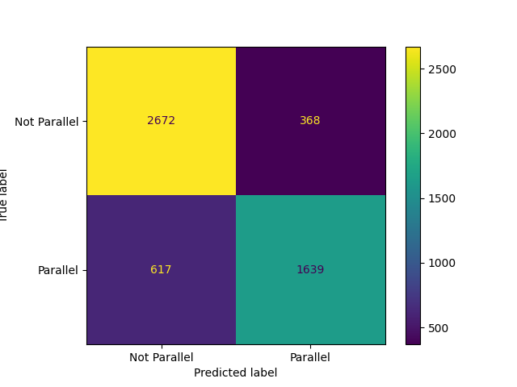

# AI-Based Auto Parallelization Advisor

This project uses a fine-tuned `deberta-v3-small` model to predict whether a given C/C++ code snippet (specifically a `for` loop) can be parallelized with an OpenMP pragma. The model was trained on the `open-omp-plus` dataset.



## Project Structure

```
ai_auto_parallelizer/
├── data/                 # Training, validation, and test datasets
│   ├── train.jsonl
│   └── ...
├── src/                  # All Python source code
│   ├── train.py          # Script to fine-tune the model
│   ├── evaluate.py       # Script to evaluate the model on the main test set
│   ├── run_benchmark.py  # Script to evaluate on benchmark datasets
│   └── run_demo.py       # A simple demo with example code snippets
├── results/              # Output directory for models and plots (ignored by git)
├── .gitignore            # Specifies files for Git to ignore
├── README.md             # This file
└── requirements.txt      # Python dependencies
```

## ⚙️ Setup

Follow these steps to set up the local environment.

### 1. Clone the Repository

```bash
git clone https://github.com/Harshagrawal526/AutoPragma
cd AutoPragma
```

### 2. Create a Virtual Environment

It's highly recommended to use a virtual environment to manage dependencies.

```bash
# For Unix/macOS
python3 -m venv venv
source venv/bin/activate

# For Windows
python -m venv venv
.\venv\Scripts\activate
```

### 3. Install Dependencies

Install all the required Python libraries using pip.

```bash
pip install -r requirements.txt
```

## 🚀 Usage

All scripts should be run from the root directory of the project (`ai_auto_parallelizer/`).

### 1. Train the Model

To start, you need to fine-tune the base `microsoft/deberta-v3-small` model on the provided dataset. This script will save the best-performing model to `results/best_model/`.

```bash
python src/train.py
```
This process may take a while depending on your hardware (a GPU is strongly recommended).

### 2. Evaluate the Model

Once training is complete, you can evaluate the model's performance on the main test set. This will print metrics (Accuracy, Precision, Recall, F1-Score) and save a confusion matrix to `results/confusion_matrix.png`.

```bash
python src/evaluate.py
```

### 3. Run Benchmark Evaluations

To evaluate the model against the specific benchmark test sets (`nas`, `poly`, `spec`):

```bash
python src/run_benchmark.py
```
This will generate separate confusion matrix plots for each benchmark dataset in the `results/` folder.

### 4. Run the Demo

To see a quick demonstration of the model's prediction capabilities on a few examples:

```bash
python src/run_demo.py
```
This script will load the fine-tuned model and classify three hard-coded code snippets, printing the results directly to the console.